# 🚀 PBA-V3
**Convergence Analysis of Parallax Bundle Adjustment (PBA) vs. Sparse Bundle Adjustment (SBA) Across 100+ BA Datasets**

<div align="center">
  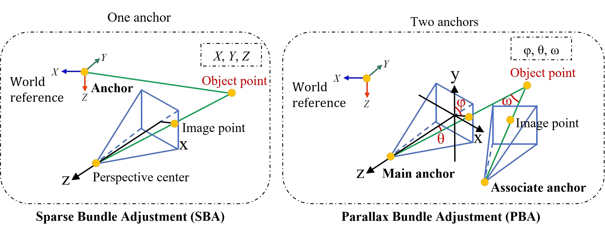
  <p align="center"><em>Illustration of the key differences between PBA and SBA</em></p>
</div>

The core difference between PBA and traditional SBA lies in the **feature parametrization**:
- **SBA**: Uses 3D Euclidean coordinates to represent map points, leading to high condition numbers and slow convergence for points at large distances or with small parallax.
- **PBA**: Represents features using parallax angles, which significantly improves numerical conditioning, especially for distant points and large-scale environments.

For a detailed introduction to the PBA formulation and its advantages, please refer to [Zhao et al. (2015)](https://doi.org/10.1177/0278364914562256):
> Zhao, L., Huang, S., Sun, Y., Yan, L., & Dissanayake, G. (2015). *Parallaxba: bundle adjustment using parallax angle feature parametrization*. The International Journal of Robotics Research, 34(4-5), 493–516.

---

## 📌 Overview

PBA-V3 is a research-oriented project for:

🔍 Systematic convergence analysis of Bundle Adjustment (BA) algorithms, focusing on PBA vs. SBA

Unlike standard BA implementations, this project emphasizes:
- 📊 First-order and second-order optimization behavior
- 📈 Iteration-wise convergence diagnostics
- 🧪 Large-scale evaluation across 100+ datasets

---

## 🎯 Project Purpose

This project aims to answer key questions in BA optimization:

- Is PBA more stable than SBA?
- Does PBA converge faster or more robustly?
- How do their:
  - Gradient behaviors differ?
  - Hessian structures compare?
  - Numerical stability characteristics evolve?

To achieve this, we build a unified convergence analysis framework.
  

## 🖥 Tested Platforms
This project has been tested on:

- **Operating System:** Windows 11  
- **Compiler / IDE:** Visual Studio 2022 (Win32)  
- **CMake version:** ≥ 3.10  

> Note: Other platforms may work, but they have not been verified.


## 📦 Dependencies
- **Cholmod**: 1.5.0   
- **Eigen**: 3.3.5

---

## ⚙️ Installation

### 1️⃣ Clone the repository
```bash
git clone https://github.com/Polar-vision/PBA-V3.git
cd PBA-V3
```

### 2️⃣ Build the BA library (ba)
```bash
cd ba
mkdir build
cmake -B build -S . -G "Visual Studio 17 2022" -A Win32
cmake --build build --config Release
```

### 3️⃣ Build the demo (example)
```bash
cd ../example
mkdir build
cmake -B build -S . -G "Visual Studio 17 2022" -A Win32
cmake --build build --config Release
```

### 4️⃣ Run the Demo
```bash
build/Release/example.exe
```

💡 Note:
Make sure you have successfully built the ba library before running the demo.
The executable file (example.exe) will be generated in the build/Release directory.

# 🚀 Datasets

## 📥 Download
You can download the dataset package from the following link:  
[**Download Datasets**](https://drive.google.com/file/d/12bO4WTqCzckXtI5Bt97uV-gMgx5J_gyU/view?usp=sharing)

After downloading, **extract the contents into the `PBA-V3/` directory**.

The final folder structure should look like this:  
PBA-V3/  
├── datasets/  
│   ├── KD1-problem-83-48102/  
│   ├── ...  
├── 3rdparty/  
├── ba/    
└── example/    

> 💡 **Tip:**  
> Make sure the dataset folder is placed correctly before running the program, otherwise the relative paths may not resolve properly.  
> If you need to use a custom dataset path, you can modify it in  
> [`3rdparty/datapath.h`](./3rdparty/datapath.h).

---

## 🗂 Data Format

Each dataset is organized in the following structure:

- **Intrinsics (`cal.txt`)**  
  Contains the camera intrinsic parameters: `fx`, `fy`, `cx`, `cy` for each camera.

- **Extrinsics (`Cam.txt`)**  
  Contains the camera poses, including Euler angles (`ez`, `ey`, `ex`), the perspective center `(Xc, Yc, Zc)`, and the camera ID.  
  - `ez` : rotation around the z-axis  
  - `ey` : rotation around the y-axis  
  - `ex` : rotation around the x-axis

- **3D Points (`XYZ.txt`)**  
  Lists the 3D coordinates of the object points: `X`, `Y`, `Z`.

- **Feature Tracks (`Feature.txt`)**  
  Each line represents a feature track, including the number of views, the corresponding image indices, and the (u, v) coordinates in each image.

---

## 📊 Data Visualization

To better understand the behavior and performance of different bundle adjustment methods, we provide **qualitative visual comparisons of 3D point clouds and camera poses**.

---

### 🎯 Visualization Targets

For each dataset, we visualize:

#### 1. Point Cloud
- Ground Truth (if available)
- Initial structure
- After PBA optimization
- After SBA optimization

#### 2. Camera Poses
- Ground Truth poses
- Initial poses
- Refined poses (PBA)
- Refined poses (SBA)

---

### 🎨 Visualization

<div align="center" style="display: flex; flex-wrap: wrap; justify-content: center; gap: 8px; max-width: 700px; margin: 0 auto;">
  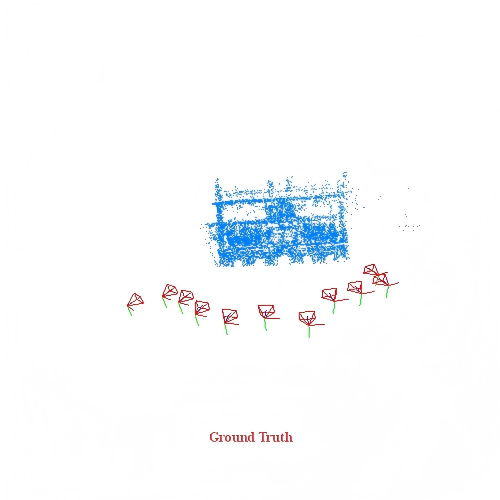
  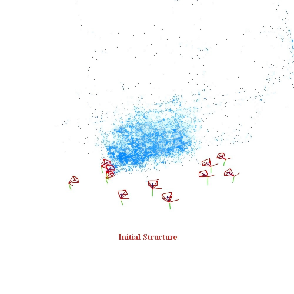
  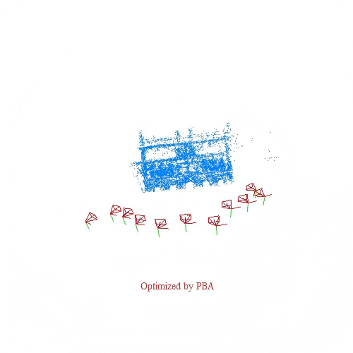
  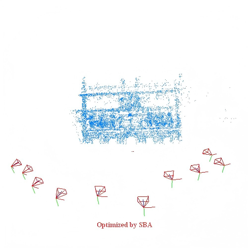
</div>

<p align="center"><em>Visual comparison on the <strong>CR1-problem-11-9611</strong> dataset.</em></p>

From the visualization results, we can clearly observe:
- The **initial reconstruction (top-right)** exhibits significant noise, scattered points, and misaligned camera trajectories, indicating large initial errors.
- Both PBA and SBA effectively optimize the noisy initial structure, but **PBA (bottom-left)** produces a significantly cleaner, more compact point cloud with fewer outliers and camera poses that closely match the ground truth.
- In contrast, **SBA (bottom-right)** retains noticeable residual noise and minor inconsistencies in both the 3D structure and camera trajectories, demonstrating less accurate error elimination and convergence behavior compared to PBA.

# 📊 Convergence Analysis Framework

We analyze BA optimization from **four perspectives**:

---

## 1️⃣ First-Order Metrics (Gradient Behavior)

### 🔹 Gradient Lipschitz Continuity
$$
L_k = \frac{\left\|g(x_{k+1}) - g(x_k)\right\|}{\left\|x_{k+1} - x_k\right\|}
$$

<div align="center" style="display: flex; align-items: center; justify-content: center; gap: 12px;">
  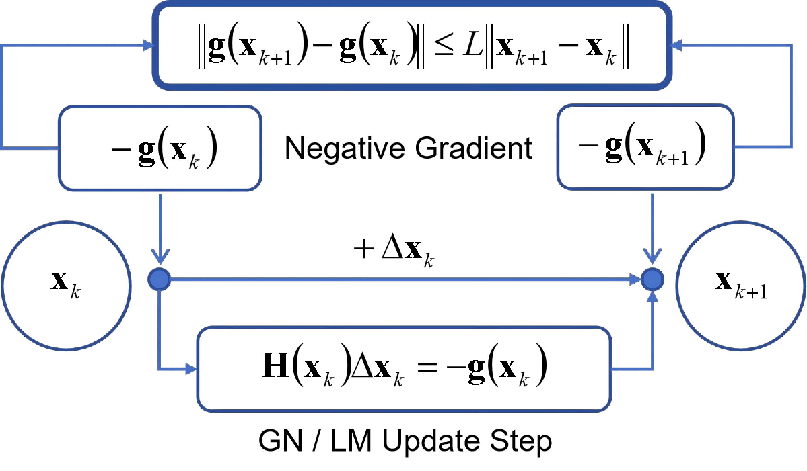
  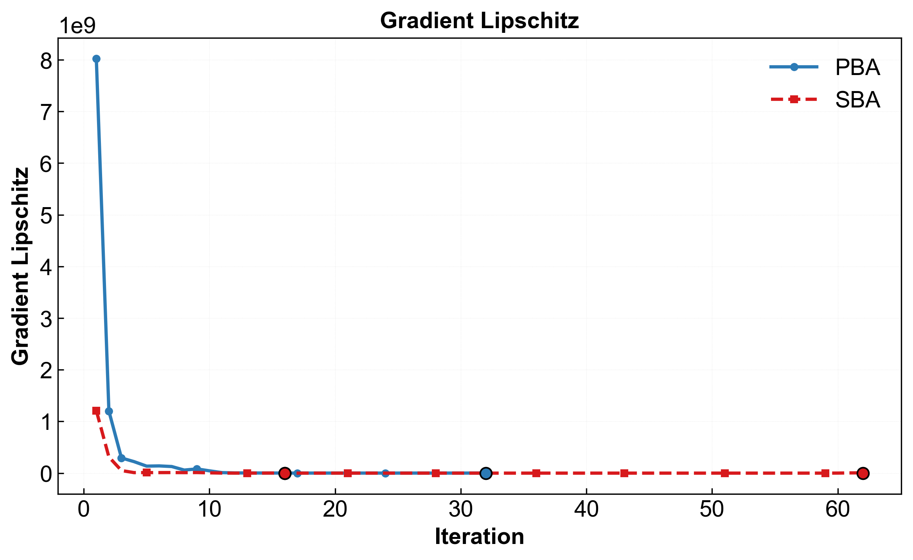
</div>
<p align="center"><em>Left: Gradient Lipschitz continuity check in GN/LM optimization | Right: Example on the <strong>CR1-problem-11-9611</strong> dataset</em></p>

This metric quantifies the **local smoothness of the gradient**, measuring how rapidly the gradient changes with respect to the parameters. It directly reflects the curvature of the objective function, which is critical for analyzing optimization stability.


#### ❓ Is a large rate of change in the gradient between consecutive iterations necessarily bad?

Not necessarily. A large gradient update ratio is not inherently problematic, and can even be a sign of healthy progress:

- ✅ **Optimization early stage**: Large gradient changes often reflect rapid progress toward the solution, as the objective function’s curvature naturally produces steep gradients far from the minimum.
- ✅ **Valid large steps**: When the optimizer (e.g., Levenberg–Marquardt) takes large, valid steps, the gradient magnitude and direction can change significantly while still converging toward a minimum.

However, large gradient changes are concerning if they coincide with:

- ⚠️ Erratic oscillations in the residual or cost function value;
- ⚠️ A loss of descent direction quality (e.g., a positive dot product between the negative gradient and the update direction);
- ⚠️ No sustained reduction in the objective function, even over multiple iterations.

> **Summary**: A large gradient change is not a direct indicator of failure, but rather a signal that must be interpreted alongside descent direction quality, residual reduction, and the optimization stage.

---

### 🔹 Gradient Direction Quality
$$
\cos(\theta_k) = \frac{-g(x_k)^\top \Delta x_k}{\left\|g(x_k)\right\| \left\|\Delta x_k\right\|}
$$

<div align="center" style="display: flex; align-items: center; justify-content: center; gap: 10px;">
  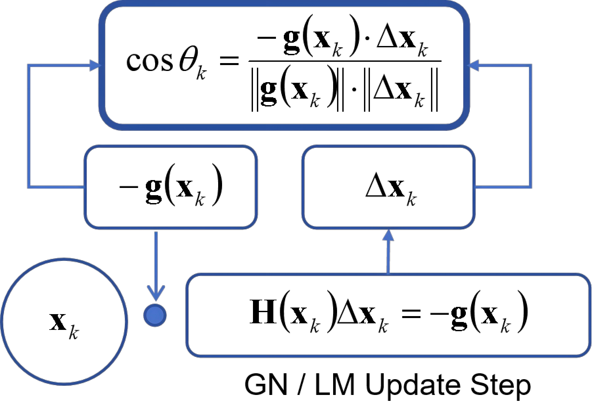
  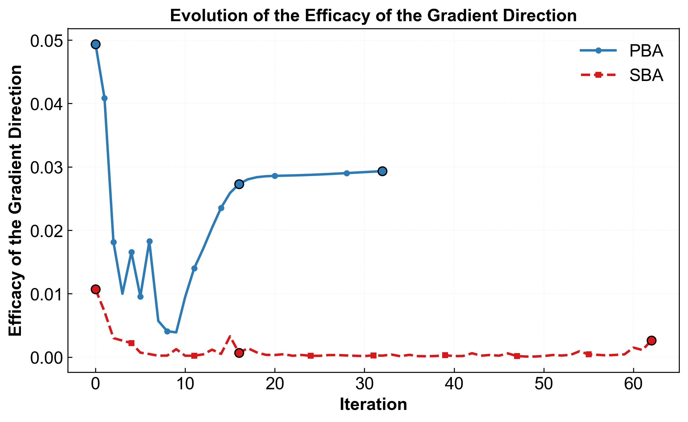
</div>
<p align="center"><em>Left: Gradient direction quality check in GN/LM optimization | Right: Example on the <strong>CR1-problem-11-9611</strong> dataset</em></p>

This metric measures the alignment between the negative gradient (steepest descent direction) and the actual parameter update direction $\Delta x_k$. It quantifies how effectively the optimization step leverages the gradient to reduce the objective function.

- $\approx 1$ → **Ideal descent**: The update direction is nearly identical to the negative gradient, maximizing the first-order descent gain.
- $\approx 0$ → **Ineffective**: The update direction is nearly orthogonal to the gradient, resulting in negligible progress.
- $< 0$ → **Wrong direction**: The update direction has a positive dot product with the gradient, meaning it is aligned with the ascent direction and will increase the objective function value.

As predicted by the condition number analysis:
- PBA maintains a gradient alignment of ~0.03 throughout the optimization, which is **an order of magnitude higher than SBA** (<0.01).
- SBA's near-zero alignment means its updates are nearly orthogonal to the descent direction, resulting in negligible progress per iteration and requiring far more iterations to converge.

> 💡 **Important Note (Levenberg-Marquardt Only)**
> A common misconception is that a gradient alignment close to 1 is always required for fast convergence. This is **only true when the Levenberg-Marquardt (LM) algorithm operates in the gradient-descent-dominated regime** (large damping factor λ).
> 
> LM is a hybrid method that interpolates between two extremes:
> - When λ is large: LM degenerates to small-step gradient descent. In this regime, gradient alignment directly determines convergence speed, as updates are proportional to the negative gradient.
> - When λ is small: LM approximates pure Gauss-Newton. In this regime, convergence speed is determined by the **accuracy of the second-order approximation** and the **allowable step size**, not the absolute alignment with the gradient direction.
> 
> This explains the performance difference between PBA and SBA:
> 1.  PBA's better numerical conditioning allows λ to drop rapidly to near zero, quickly entering the fast-converging Gauss-Newton regime.
> 2.  SBA's poor conditioning forces it to remain in the high-damping, gradient-descent-dominated regime for much longer. Worse, its extremely low gradient alignment in this regime makes even gradient descent highly ineffective.
> 
> Thus, gradient alignment is only a critical metric in the early, high-damping stages of LM. PBA's superior performance stems from its ability to both exit this slow regime faster and achieve better alignment when it matters most.

---

## 2️⃣ Second-Order Metrics (Hessian / Schur Structure)

### 🔹 Condition Number
$$
\kappa(S) = \frac{\sigma_{\max}}{\sigma_{\min}}
$$

<div align="center" style="display: flex; align-items: center; justify-content: center; gap: 10px;">
  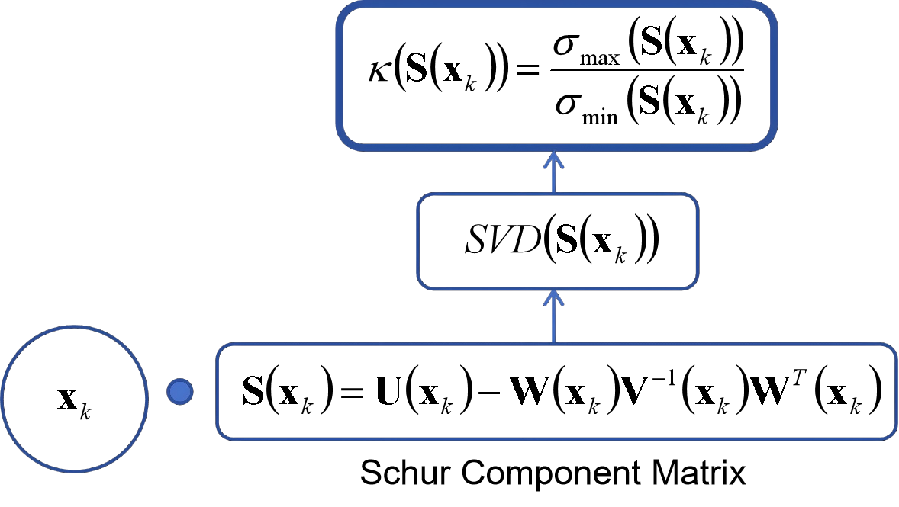
  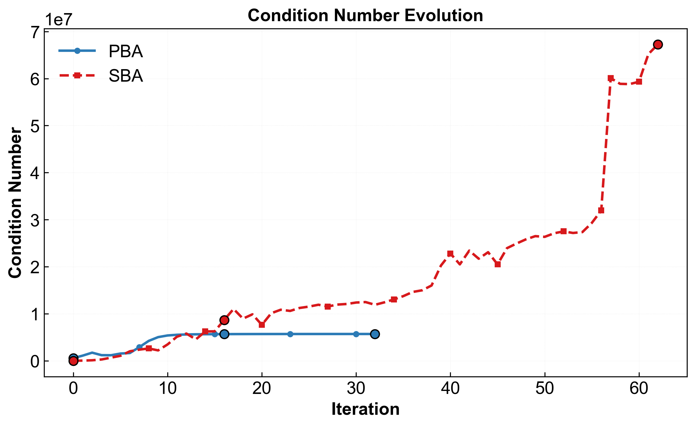
</div>
<p align="center"><em>Left: Condition number check in GN/LM optimization | Right: Example on the <strong>CR1-problem-11-9611</strong> dataset</em></p>

This metric quantifies the **numerical stability** and **ill-conditioning** of the Hessian matrix $\mathbf{H}$ or the Schur complement matrix $S$. It is defined as the ratio between the largest and smallest singular values (or eigenvalues).

- **Large values (→ ill-conditioned)**: Indicates severe numerical instability, potential divergence, or slow convergence. The optimization problem is sensitive to small perturbations.
- **Small values (→ stable)**: Indicates a well-conditioned problem. The optimization landscape is smooth, and convergence is robust and predictable.

From the plot, we observe a stark contrast between the two methods:
- **PBA** stabilizes at a low condition number after the early iterations and remains nearly constant throughout the rest of the optimization. This confirms that PBA maintains a well-conditioned system from the middle stages onward, leading to stable and predictable updates.
- **SBA**’s condition number, by contrast, grows continuously and accelerates sharply in the later iterations, reaching values an order of magnitude higher than PBA’s. This growing ill-conditioning directly explains SBA’s slower convergence, higher number of rejected steps, and overall less stable behavior observed in previous metrics.

This curve provides a direct, high-level confirmation of the core advantage of PBA’s parametrization: it keeps the problem numerically well-conditioned throughout the entire optimization process.

---

### 🔹 Singular Value Spectrum
$$
\sigma_1 \ge \sigma_2 \ge \dots \ge \sigma_n
$$

<div align="center" style="display: flex; align-items: center; justify-content: center; gap: 10px;">
  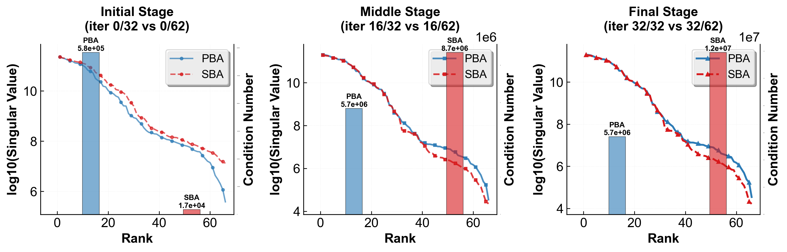
  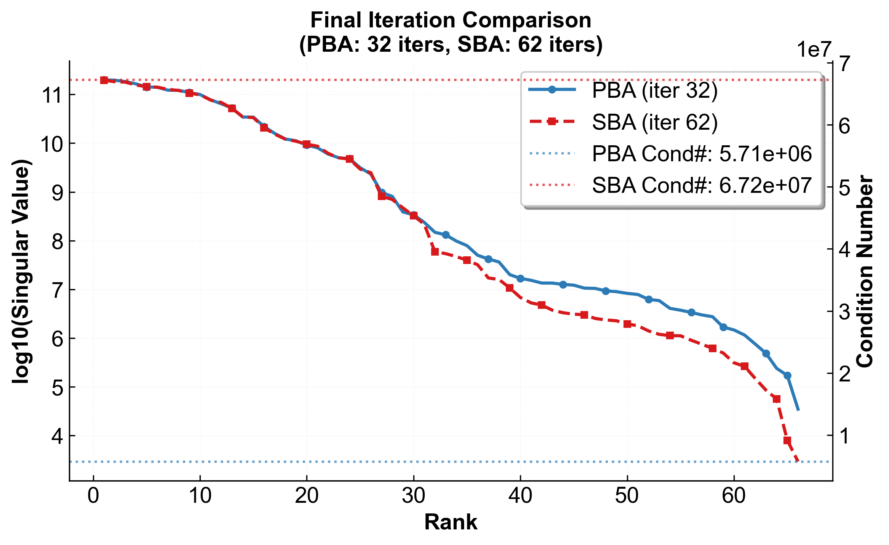
</div>
<p align="center"><em>Left: Evolution of the singular value spectrum for PBA and SBA across initial, middle, and final optimization stages. Right: Final iteration comparison of singular value spectra and corresponding condition numbers on the <strong>CR1-problem-11-9611</strong> dataset.</em></p>

The ordered singular values of the Schur complement matrix $$\( \mathbf{S} \)$$, sorted from largest to smallest. This spectrum is used to detect:
- **Degeneracy**: Near-zero singular values indicate rank deficiency or an ill-posed problem.
- **Weakly constrained directions**: Directions with very small singular values correspond to low-curvature, poorly observable modes, which can slow down convergence.

From the plots, we observe clear differences between PBA and SBA:
- **Initial stage**: At the start of optimization, SBA shows a slightly higher minimum singular value, but its spectrum decays much more steeply across the mid-to-low end. PBA, by contrast, maintains a flatter, more balanced spectrum throughout the range, indicating a more even distribution of curvature.
- **Middle and final stages**: As iterations progress, the gap widens dramatically. PBA’s spectrum remains well-conditioned, with a significantly higher tail (minimum singular values) than SBA. SBA’s spectrum decays rapidly, leading to very small singular values at the tail, which introduce ill-posed directions into the optimization.
- **Final iteration comparison**: PBA completes in only 32 iterations with a condition number of \( 5.71 \times 10^6 \), while SBA requires 62 iterations and ends with a much higher condition number of \( 6.72 \times 10^7 \). This directly quantifies PBA’s superior numerical conditioning, which leads to faster, more stable convergence.

These spectral differences confirm that PBA’s parallax-based parametrization effectively eliminates the ill-posed directions present in SBA, resulting in a more balanced singular value spectrum and a significantly better-conditioned optimization problem.

---

### 🔹 Extreme Singular Values

Singular values of the normal matrix $$\( \mathbf{J}^\top\mathbf{J} \)$$ reveal key properties of the optimization landscape and numerical conditioning.

<div align="center">
  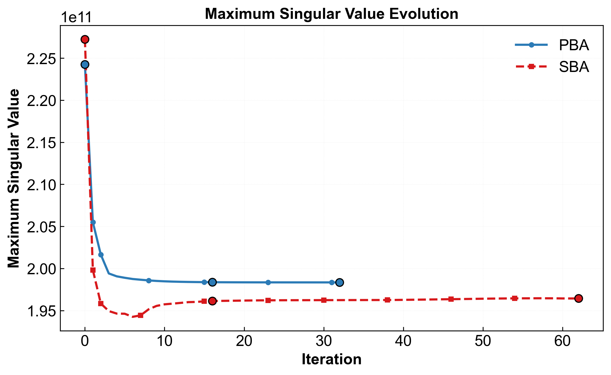
</div>
<p align="center"><em>Maximum singular value evolution for PBA vs. SBA on the CR1-problem-11-9611 dataset.</em></p>

- $$\( \sigma_{\max} \rightarrow \)$$ **Curvature upper bound**: The largest singular value sets an upper bound on the maximum curvature of the objective function, indicating the steepest directions in the optimization landscape.
- Both PBA and SBA start with similarly large $$\( \sigma_{\max} \)$$, but PBA reduces it more rapidly and stabilizes at a slightly higher level than SBA. This shows that PBA quickly dampens extreme curvature, leading to a more well-behaved optimization landscape.

<div align="center" style="display: flex; align-items: center; justify-content: center; gap: 10px;">
  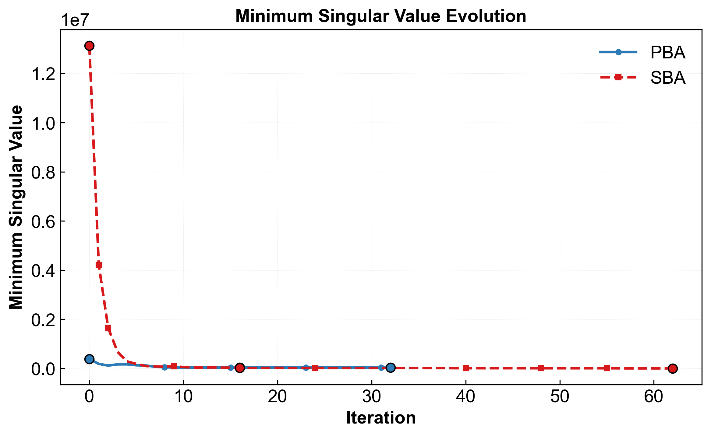
  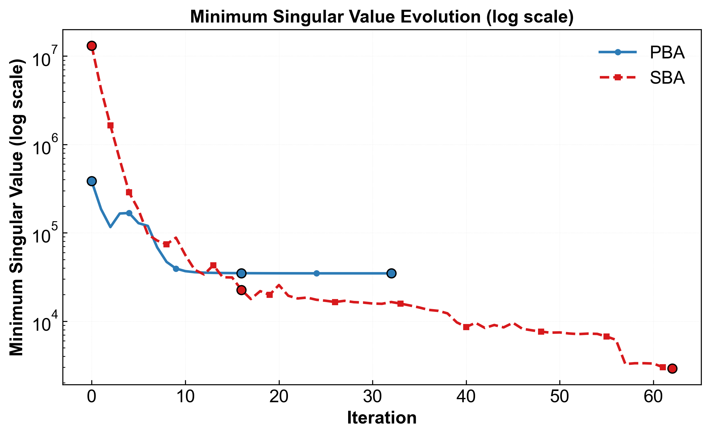
</div>
<p align="center"><em>Left: Minimum singular value evolution (linear scale). Right: Minimum singular value evolution (log scale), revealing the full difference in conditioning.</em></p>

- $$\( \sigma_{\min} \rightarrow \)$$ **Observability & conditioning**: The smallest non-zero singular value quantifies the strength of the weakest constraint, directly relating to the problem’s observability and numerical stability. A larger $$\( \sigma_{\min} \)$$ means better conditioning.
- On the linear scale, both methods appear to converge to near-zero $$\( \sigma_{\min} \)$$. However, the log-scale plot clearly shows that **PBA maintains a significantly larger minimum singular value than SBA** throughout the entire optimization. This confirms that PBA’s feature parametrization improves the numerical conditioning of the problem, leading to a more stable and better-posed system compared to SBA.

Taken together, these curves demonstrate that PBA achieves a more balanced spectrum: a controlled $$\( \sigma_{\max} \)$$ and a much higher $$\( \sigma_{\min} \)$$, resulting in a substantially lower condition number and superior numerical stability.

---

## 🔹 3️⃣ Stopping Criteria

### 🔹 Relative State Change

$$
\frac{\left\|\mathbf{x}_k - \mathbf{x}_{k-1}\right\|}{\left\|\mathbf{x}_{k-1}\right\|}
$$

<div align="center" style="display: flex; align-items: center; justify-content: center; gap: 10px;">
  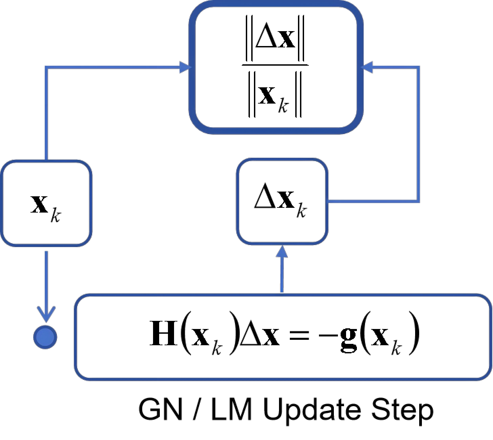
  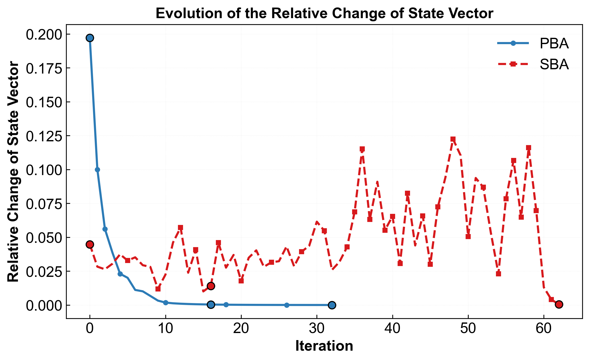
</div>
<p align="center"><em>Left: Relative state change computation flow | Right: Example on the <strong>CR1-problem-11-9611</strong> dataset</em></p>

Measures the relative change in the state vector between consecutive iterations. When this value falls below a predefined threshold, the optimization is considered to have converged.

From the plot, we observe that:
- **PBA** shows a large initial relative change, reflecting aggressive and effective updates that quickly adjust the state vector toward the optimum. By iteration 10, the relative change drops to near zero and remains stable, indicating that the parameters have converged to a fixed solution.
- **SBA** exhibits persistent, large fluctuations in relative state change throughout the entire optimization process. Even after 60 iterations, the values remain significantly above zero, showing that the state vector continues to drift and the optimization has not fully stabilized.

This metric directly confirms that PBA reaches a stable, fully converged state much earlier than SBA, which struggles to settle into a consistent solution due to its less favorable numerical conditioning.

---

### 🔹 Relative MSE Change

$$
\frac{\left| \varepsilon(\mathbf{x}_k) - \varepsilon(\mathbf{x}_{k-1}) \right|}{\varepsilon(\mathbf{x}_k)}
$$

<div align="center" style="display: flex; align-items: center; justify-content: center; gap: 10px;">
  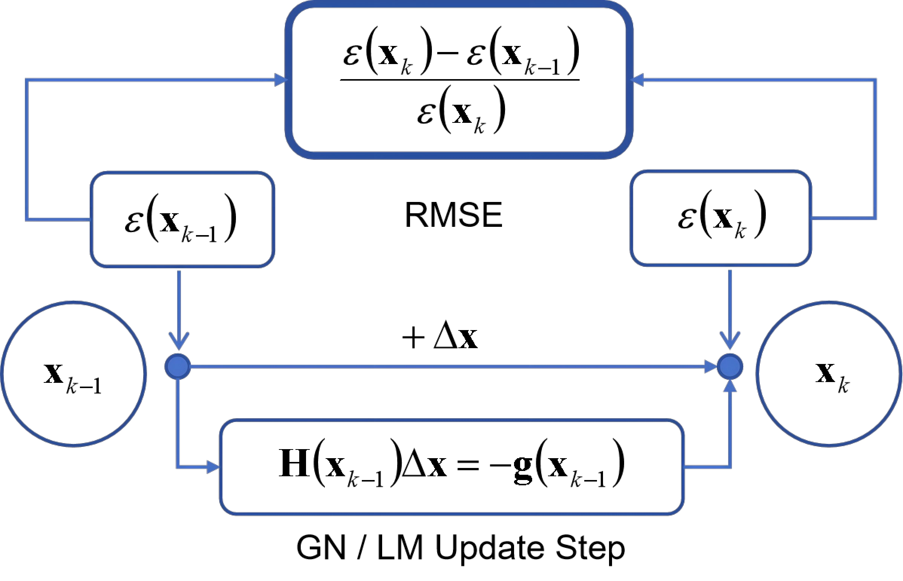
  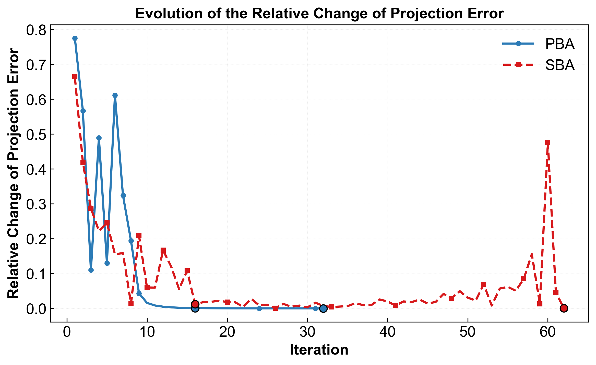
</div>
<p align="center"><em>Left: Relative MSE change computation flow. Right: Example on the <strong>CR1-problem-11-9611</strong> dataset</em></p>

Measures the relative change in the objective function (reprojection error / MSE) between consecutive iterations. A value below a given threshold indicates that the cost is no longer improving significantly.

From the plot, we observe that:
- **PBA** exhibits large relative changes in the early iterations, indicating rapid, high-impact updates that quickly reduce the reprojection error. By iteration 15, the relative change drops to near zero and remains stable, showing that the cost function has converged to a stable minimum.
- **SBA** takes much longer to stabilize: its relative change remains non-zero for most iterations, with persistent fluctuations and a sharp spike near the end. This indicates slow, incremental progress and lingering instability, even late in the optimization process.

This metric confirms that PBA reaches a stable, fully converged state much earlier than SBA, while SBA continues to make small adjustments throughout the entire process without fully settling.

---

### 🔹 Max Gradient Component

$$
\max_i \left| \mathbf{g}_i \right|
$$

<div align="center" style="display: flex; align-items: center; justify-content: center; gap: 10px;">
  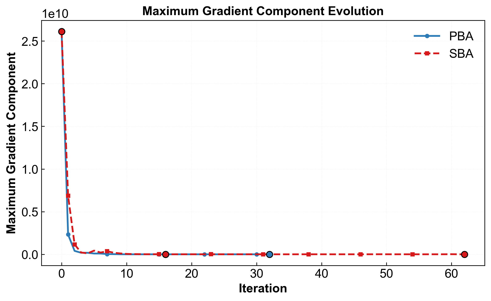
  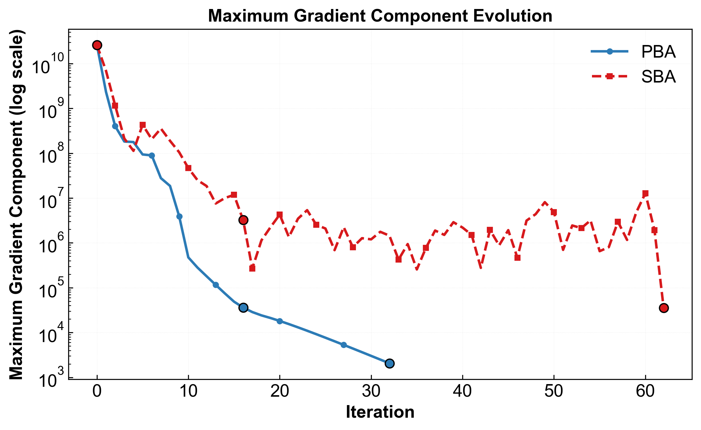
</div>
<p align="center"><em>Left: Maximum gradient component evolution (linear) for PBA vs. SBA on CR1-problem-11-9611. Right: Maximum gradient component evolution (log scale).</em></p>

- Detects poorly converged variables by tracking the maximum absolute value of the gradient components across all parameters.
- Serves as a robust stopping criterion: a sufficiently small maximum gradient indicates that no single variable has a significant remaining descent direction.

From the plots, we observe that:
- **PBA** reduces the maximum gradient to near zero in just a few iterations, as clearly seen in both the linear and log-scale plots. This indicates fast, stable progress toward the optimum, with no lingering large gradients.
- **SBA**, while also converging on the linear scale, exhibits significantly higher residual gradients throughout the process, as highlighted by the log-scale plot. Even after 60 iterations, its maximum gradient remains orders of magnitude larger than PBA’s, reflecting slower progress and a less fully converged state.

This metric directly confirms that PBA achieves both faster and more complete convergence, as it eliminates the largest residual gradients far more effectively than SBA.

---

## 🔹 4️⃣ Convergence Behavior Tracking

### 🔹 Reprojection Error

$$
\text{MSE} = \frac{1}{N} \sum \left\| r_i \right\|^2
$$

<div align="center">
  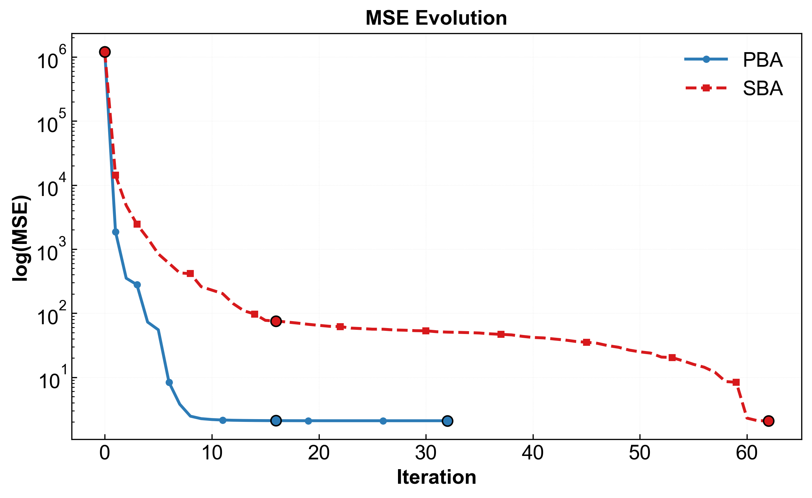
</div>
<p align="center"><em>MSE evolution (log scale) across iterations for PBA vs. SBA on the <strong>CR1-problem-11-9611</strong> dataset.</em></p>

Mean Squared Error (MSE) of reprojection residuals. Tracks the objective function value across iterations.

On the log-scaled MSE curve, PBA converges orders of magnitude faster and reaches a much lower final error plateau. SBA requires far more iterations to reduce the error, and its final residual remains significantly higher, indicating slower and less effective convergence.

---

### 🔹 Damping Factor ($\lambda$)

$$
\mathbf{H} \leftarrow \mathbf{J}^\top \mathbf{J} + \lambda \cdot \mathbf{I}
$$

<div align="center" style="display: flex; align-items: center; justify-content: center; gap: 10px;">
  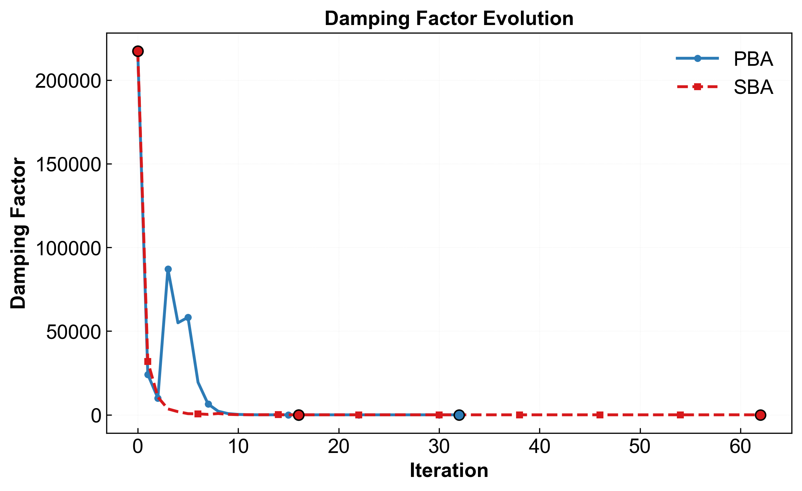
  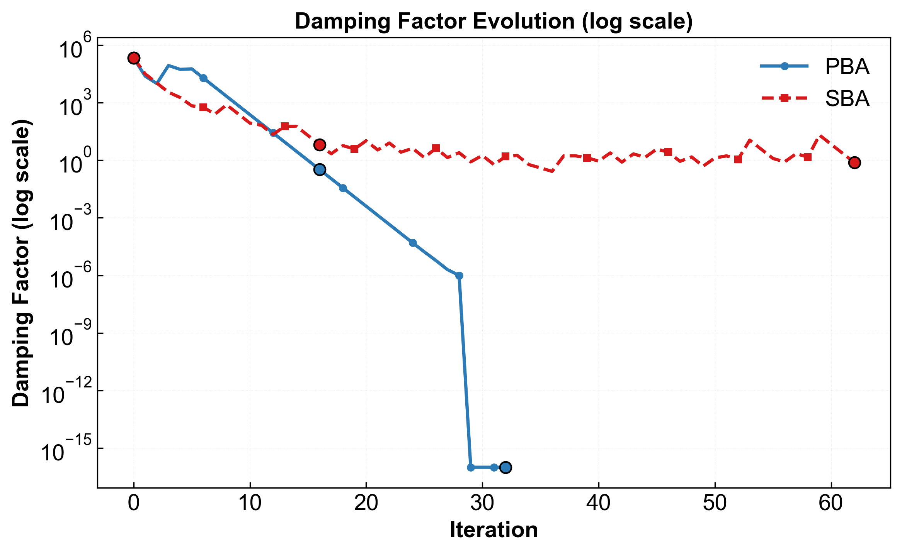
</div>
<p align="center"><em>Left: Damping factor evolution (linear) for PBA vs. SBA on CR1-problem-11-9611. Right: Damping factor evolution (log scale).</em></p>

Controls the transition between:
- **Gauss-Newton**: Large steps with quadratic convergence (when $\lambda$ is small).
- **Gradient Descent**: Small, stable steps (when $\lambda$ is large).

In the plot, both methods start with a large damping factor, but PBA reduces it to near zero much faster. This shows that PBA rapidly enters the Gauss-Newton regime, where it can take large, efficient steps with quadratic convergence. SBA, by contrast, remains in a high-damping state for longer, leading to slower progress.

---

### 🔹 Gain Ratio ($\rho$)

$$
\rho = \frac{\Delta F_{\text{actual}}}{\Delta F_{\text{model}}}
$$

<div align="center" style="display: flex; align-items: center; justify-content: center; gap: 10px;">
  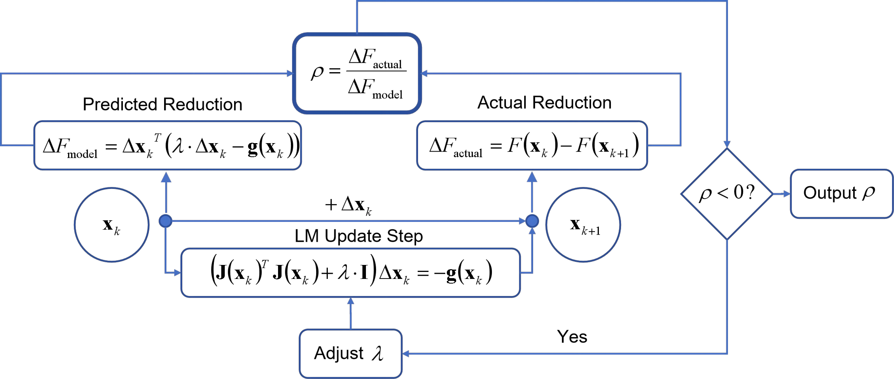
  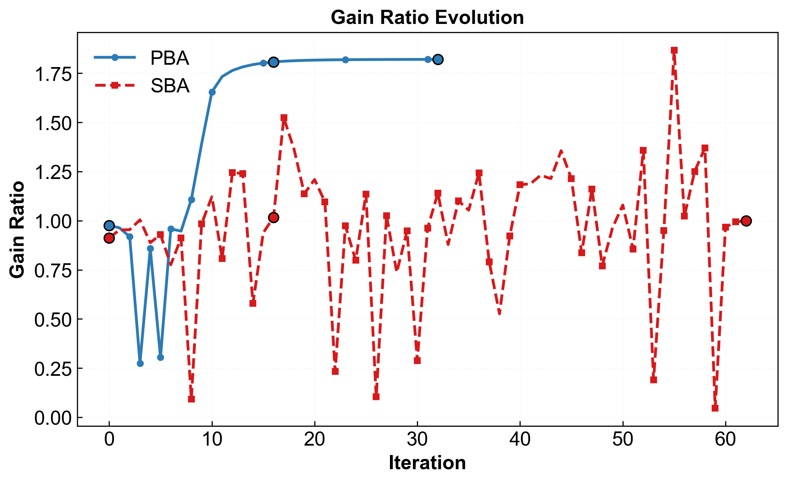CR1-problem-11-9611</strong> dataset." style="height: 250px; width: auto;">
</div>
<p align="center"><em>Left: Gain ratio computation flow in the LM algorithm. Right: Examples on the <strong>CR1-problem-11-9611</strong> dataset.</em></p>

- $\rho > 1$ → **Over-performing step**: The actual cost reduction is greater than the linear model predicted. This indicates that the quadratic approximation is overly conservative, and the step size can safely be increased (or $\lambda$ decreased further) to speed up convergence.
- $0 < \rho \le 1$ → **Successful step**: The update reduced the cost function as expected; the step is accepted and $\lambda$ is decreased.
- $\rho < 0$ → **Rejected step**: The update increased the cost function; the step is rejected and $\lambda$ is increased.

The ratio quantifies how well the linear model approximates the true cost reduction, and directly drives the damping factor adjustment logic in the LM algorithm.

In the plot, PBA's gain ratio quickly stabilizes near 1.0 after a small number of iterations, indicating that the quadratic model closely matches the actual cost reduction, leading to reliable and efficient updates. In contrast, SBA exhibits large, frequent fluctuations, with many iterations far below 1.0 and occasional near-zero values, reflecting poor linear approximations, frequent rejected steps (**verified in the subsequent Trial Count section**), and an overall less stable optimization process.

---

### 🔹 Trial Count

<div align="center">
  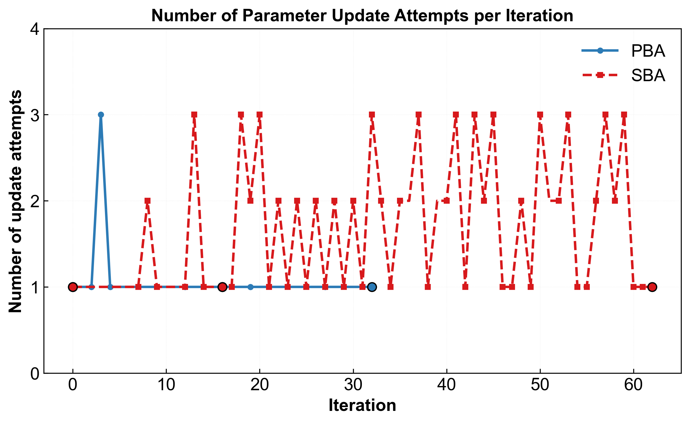
</div>
<p align="center"><em>Number of parameter update attempts per iteration for PBA vs. SBA on the <strong>CR1-problem-11-9611</strong> dataset.</em></p>

- Number of LM update attempts per iteration before accepting a successful step.
- Reflects the quality of the damping parameter schedule and the overall optimization stability.

The plot shows that PBA maintains nearly all iterations with only one attempt, indicating highly reliable damping factor adjustment. In contrast, SBA requires frequent retries, reflecting a more unstable and less well-conditioned optimization process.
